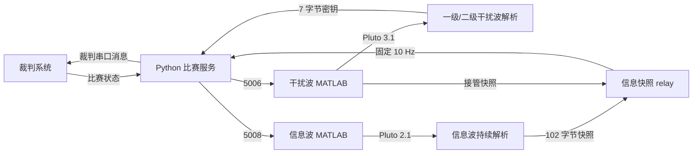
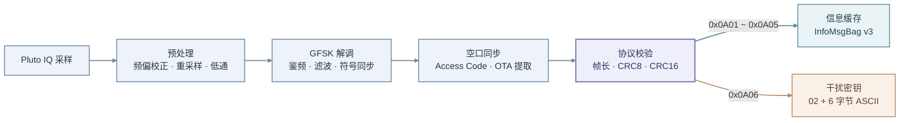
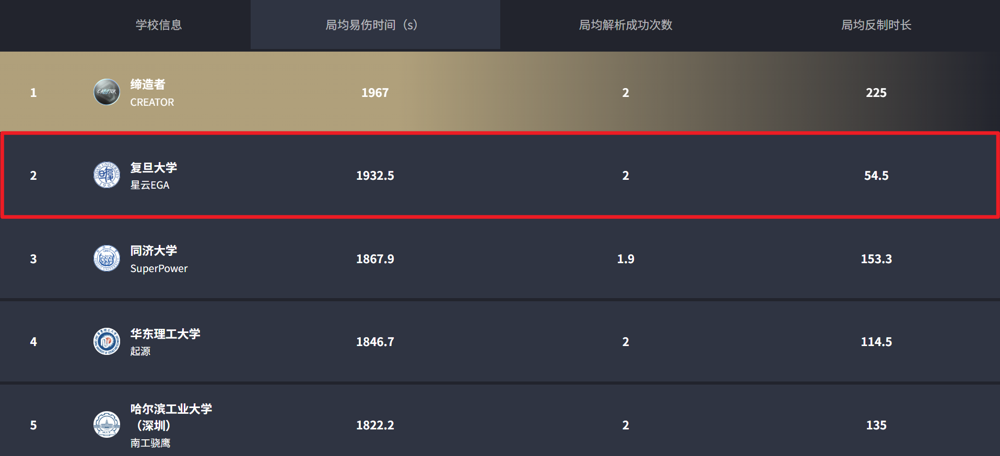
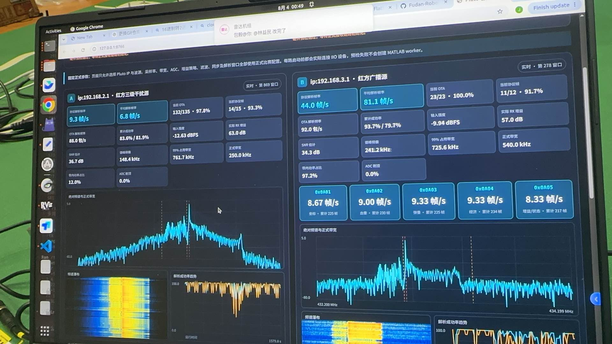

# RM2026 Pluto 电磁波解析

本项目使用两块运行 Pluto 兼容固件的 SDR 接收并解析 RoboMaster 2026 雷达电磁波，覆盖信息波、一级/二级干扰波、双接收板故障接管、比赛状态驱动、解码结果缓存，以及向裁判系统和己方机器人发送解析结果的完整流程。

项目采用 MATLAB 完成 Pluto 采集、GFSK 解调和空口协议解析，采用 Python 完成比赛状态、UDP 快照仲裁、裁判串口协议和业务消息调度。

比赛实测使用微相 E310 开发板。该板提供 2T2R 射频通道，选用它是为了给后续 MIMO 接收开发预留硬件能力；当前正式代码仍按每块板单接收通道工作，尚未实现 MIMO。项目不强制使用 E310，ADALM-Pluto 或其他能够运行 Pluto 兼容固件、可由 libiio 和 MATLAB Pluto 支持包识别的 SDR 均可使用。

## 功能

- 支持红方、蓝方信息波：`red_broadcast`、`blue_broadcast`。
- 支持正式比赛一级、二级干扰波解析和 6 字节密钥回传。
- 保留三级干扰波的波源配置、手动发射和 Web 收发能力，用于自制发射源与物理层测试；正式自动流程不解析三级。
- 支持 `0x0A01`～`0x0A05` 五类信息波命令分别校验、分别缓存和新鲜度管理。
- 信息快照只使用固定 102 字节 `InfoMsgBag v3`，长度或版本不匹配的 UDP 包直接拒绝。
- 支持信息波主接收板与干扰波主接收板之间的自动故障接管。
- 支持裁判串口自动探测、CRC 校验、断线重连和全局帧序号。
- 支持 `0x0305`、`0x0301/0x0121`、`0x02AA`、`0x02AB`、`0x0233` 结果利用。
- 提供双 Pluto 实时频谱/瀑布图诊断页面和通用仿真/收发 Web 页面。
- 提供 Python、MATLAB 无硬件回归测试。

详细原理见：

- [解析算法说明](docs/decoding_algorithm.md)
- [解析信息利用与通信说明](docs/communication_and_usage.md)
- [比赛实绩与应用案例](docs/results_showcase.md)
- [Linux 部署说明](docs/linux_deployment.md)

## 运行流程



默认设备分工：

| 设备 | 地址 | 正常职责 |
|---|---|---|
| 信息波 Pluto | `ip:192.168.2.1` | 持续接收己方需要解析的广播源 |
| 干扰波 Pluto | `ip:192.168.3.1` | 按裁判反馈解析当前一级或二级干扰源 |

## 解析算法总览



完整的参数、帧结构和连续解码机制见[解析算法说明](docs/decoding_algorithm.md)。

## 比赛实绩与应用案例

本项目已在 RoboMaster 比赛中完成实际部署。全国总决赛官方展示中，复旦大学星云 EGA 的雷达局均易伤时间为 `2303.7 秒/局`、全国第一，哨兵总命中率为 `46.13%`、全国第一。

- 信息波持续解析敌方位置，为雷达累计易伤提供稳定、准确的位置输入。
- `0x0233` 将可瞄准状态发送给哨兵，过滤无敌和不可攻击目标，减少无效射击并提高有效命中率。

| 雷达局均易伤全国第一 | 哨兵命中率全国第一 |
|---|---|
|  |  |

赛事解析统计中，局均易伤时间和解析成功次数同样达到全国第一：



双 Pluto Web 实时调试页面可同时观察两路频谱、瀑布图、OTA/协议帧成功率、信号强度、SNR、频偏和五类信息波命令更新率：



三级干扰波解析画面及四项下游利用视频见[比赛实绩与应用案例](docs/results_showcase.md)。这些素材用于说明真实比赛效果，不参与程序运行。

## 目录结构

```text
RM2026_Waves_Analyze/
├── README.md                         项目入口文档
├── start.sh                          Linux 正式启动入口
├── run_tests.sh                      Python、MATLAB、Shell 综合测试
├── requirements.txt                  Python 依赖
├── project_setup.m                   MATLAB 路径初始化
├── FSK_RRC_ProjectConfig.m           仿真、收发和公共默认参数
├── FSK_RRC_AutoMatchUdp.m            比赛状态机、双板接管和结果回传
├── FSK_RRC_Recv.m                    单窗口 Pluto/IQ 接收与完整解调入口
├── InfoWaveContinuousReceiver.m      信息波连续采集、环形缓冲和 worker 管理
├── FSK_RRC_InfoDecodeWorker.m        信息波常驻解码子进程
├── FSK_RRC_DecodeInfoWindow.m        单个信息波窗口解码包装
├── FSK_RRC_Trans.m                   GFSK 波形生成与 Pluto 发射入口
├── FSK_RRC_Sim.m                     无硬件信道仿真入口
├── FSK_RRC_WebDiagnosticWorker.m     实时 Web 诊断 MATLAB worker
├── trans.m                           手动选择信息波/干扰波发射源
├── wave_service.py                   Python 比赛通信入口
├── info_wave_udp_relay.py            信息快照主备仲裁与固定频率转发
├── monitor_status.py                 终端状态监视器
├── run_pluto_wave_web_diagnostic.sh  双 Pluto 实时诊断页面入口
│
├── config/
│   └── wave.env.example              Linux 现场配置模板
├── core/
│   ├── get_gfsk_source_config.m      八种波源的频点、带宽和调制参数
│   ├── build_gfsk_rx_reference.m     接收端参考参数
│   ├── build_gfsk_tx_waveform.m      GFSK 发射波形构造
│   ├── decode_gfsk_symbol_stream.m   符号流、Access Code、OTA 解码
│   ├── fsk_discriminator_hz.m        相位差鉴频
│   ├── filter_info_wave_updates.m    信息波命令更新去重与排序
│   └── validate_gfsk_source_config.m 波源参数一致性检查
├── protocol/
│   ├── get_protocol_constants.m      Access Code、包长、CRC 等常量
│   ├── build_ota_packet.m            27 字节 OTA 包构造
│   ├── build_ota_stream.m            协议数据到 OTA 包流
│   ├── parse_ota_packet.m            Access Code 与 OTA 头校验
│   ├── build_protocol_frame.m        业务协议帧构造
│   ├── parse_protocol_frame.m        0x0A01～0x0A06 解析
│   ├── extract_valid_ota_packets.m   OTA 包提取
│   ├── extract_valid_protocol_frames.m 协议帧提取和 CRC 校验
│   ├── get_source_protocol_cycle.m   信息波/干扰波单周期布局
│   ├── protocol_frame_to_text.m      解码结果文本化
│   └── protocol_payload_matches_expected.m 仿真期望数据比较
├── CRC/                              MATLAB CRC8/CRC16 实现和查表
├── math/                             字节/比特转换、高斯滤波器生成
├── utils/                            Pluto 复用、IIO 带宽、设备地址等工具
│
├── wave_runtime/
│   ├── crc.py                        裁判串口 CRC8/CRC16
│   ├── protocol.py                   UDP、InfoMsgBag、裁判帧封装与解析
│   ├── serial_io.py                  Linux 串口探测、排除 Pluto、自动重连
│   ├── state.py                      新小局、密钥、信息缓存和业务构造
│   └── service.py                    UDP/串口事件循环和发送调度
├── scripts/
│   ├── check_pluto_links.sh          网络、IIO、USB 状态检查
│   ├── watch_pluto_links.sh          Pluto 在线状态监视
│   └── apply_pluto_stability.sh      USB 防休眠与 ModemManager 规则
├── tests/                            当前协议和状态机回归测试
├── display/                          比赛实绩图片与解析结果利用视频
├── docs/                             算法、通信、应用案例与 Linux 部署文档
└── tool/
│   ├── live_wave_debugger/           双 Pluto 正式参数实时诊断页面
│   └── web_debugger/                 仿真、发射、接收通用 Web 页面
```

## 环境要求

### Linux

- Ubuntu 22.04/24.04 或兼容发行版。
- Python 3.10 及以上。
- MATLAB 与 Communications Toolbox。
- Communications Toolbox Support Package for Analog Devices ADALM-Pluto Radio。
- `libiio-utils`、`iproute2`、`iputils-ping`。
- 两块运行 Pluto 兼容固件的 SDR；比赛实测为微相 E310。
- RoboMaster 裁判系统串口。

安装系统和 Python 依赖：

```bash
sudo apt update
sudo apt install -y python3 python3-pip libiio-utils iproute2 iputils-ping
python3 -m pip install --user -r requirements.txt
```

MATLAB 中执行 `supportPackageInstaller`，安装 PlutoSDR 支持包。

## Pluto 网络配置

两块 Pluto 必须处于不同子网：

```text
信息波板：192.168.2.1
干扰波板：192.168.3.1
```

必须在两块板各自的 Pluto 固件 `config.txt` 中配置不同地址。建议一次只连接一块板，修改后安全弹出设备并重新上电。

信息波板：

```ini
[NETWORK]
hostname = pluto-info
ipaddr = 192.168.2.1
ipaddr_host = 192.168.2.10
netmask = 255.255.255.0
```

干扰波板：

```ini
[NETWORK]
hostname = pluto-jammer
ipaddr = 192.168.3.1
ipaddr_host = 192.168.3.10
netmask = 255.255.255.0
```

如果所用兼容固件不通过 U 盘 `config.txt` 管理网络，应使用该固件提供的等效配置方式，最终必须保证 libiio 可分别通过 `ip:192.168.2.1` 和 `ip:192.168.3.1` 访问两块板。

主机对应的 USB 网卡需要分别具有 `192.168.2.x/24` 和 `192.168.3.x/24` 地址。启动前执行：

```bash
./scripts/check_pluto_links.sh
```

首次部署建议安装稳定性规则：

```bash
sudo ./scripts/apply_pluto_stability.sh
```

## 配置

复制模板：

```bash
cp config/wave.env.example config/wave.env
```

`config/wave.env` 不纳入版本管理。主要配置如下：

| 变量 | 默认值 | 说明 |
|---|---:|---|
| `INFO_RX_RADIO_ID` | `ip:192.168.2.1` | 信息波接收设备 |
| `JAMMER_RX_RADIO_ID` | `ip:192.168.3.1` | 干扰波接收设备 |
| `REFEREE_PORT` | `auto` | 裁判串口；也可指定 `/dev/ttyACM0` |
| `REFEREE_BAUDRATE` | `115200` | 裁判串口波特率 |
| `JAMMER_STATUS_PORT` | `5006` | 干扰波 MATLAB 状态输入 |
| `WAVE_RETURN_PORT` | `5007` | 密钥和信息快照返回端口 |
| `INFO_STATUS_PORT` | `5008` | 信息波 MATLAB 状态输入 |
| `INFO_RELAY_PORT` | `5010` | 信息波主来源快照输入 |
| `INFO_FAILOVER_RELAY_PORT` | `5012` | 接管来源快照输入 |
| `INFO_CAPTURE_SAMPLE_RATE_HZ` | `1000000` | 信息波 Pluto 采样率 |
| `JAMMER_CAPTURE_SAMPLE_RATE_HZ` | `2000000` | 干扰波 Pluto 采样率 |
| `INFO_STREAM_DECODE_WINDOW_SEC` | `0.25` | 信息波解码窗口长度 |
| `INFO_STREAM_DECODE_STRIDE_SEC` | `0.10` | 相邻窗口步长 |
| `INFO_STREAM_RING_BUFFER_SEC` | `1.0` | 信息波环形缓冲时长 |
| `INFO_STREAM_WORKER_COUNT` | `2` | 信息波解码 worker 数量 |
| `INFO_FRESH_WINDOW_SEC` | `3.0` | 信息命令新鲜度窗口 |

## 启动

```bash
chmod +x start.sh run_tests.sh run_pluto_wave_web_diagnostic.sh scripts/*.sh
./start.sh
```

启动脚本会创建并管理：

1. Python 比赛通信服务；
2. 信息快照 relay；
3. 信息波 MATLAB 接收进程；
4. 干扰波 MATLAB 接收进程；
5. 可选 Pluto 链路监视进程。

任一核心进程退出后，启动脚本会停止整组进程。按 `Ctrl-C` 可正常退出并释放 Pluto。

## 状态与日志

运行数据写入 `.runtime/`：

```text
.runtime/status.json
.runtime/logs/runtime.log
.runtime/logs/relay.log
.runtime/logs/info_matlab.log
.runtime/logs/jammer_matlab.log
.runtime/logs/pluto_links.log
```

状态监视：

```bash
python3 monitor_status.py
```

`status.json` 中包含比赛阶段、阵营、干扰等级、信息命令 valid/fresh、坐标新鲜度、串口状态和各类串口消息计数。

## Web 调试

### 双 Pluto 实时诊断

```bash
./run_pluto_wave_web_diagnostic.sh
```

打开 `http://127.0.0.1:8766`。页面显示频谱、瀑布图、增益、削顶、SNR、频偏、有效 OTA 包和协议帧。页面调用与运行流程相同的解调函数，但不发送比赛业务数据。

### 通用仿真与收发页面

```bash
python3 tool/web_debugger/server.py --host 127.0.0.1 --port 8765
```

该页面提供：

- 无硬件 GFSK 仿真；
- 波形生成和有限时长 Pluto 发射；
- Pluto 单窗口接收与解析；
- 参数和结果文件查看。

## 手动 MATLAB 调用

初始化路径：

```matlab
project_setup;
```

无硬件仿真：

```matlab
result = FSK_RRC_Sim( ...
    'SourceName', 'red_broadcast', ...
    'ShowPlots', false);
```

单次接收：

```matlab
result = FSK_RRC_Recv( ...
    'SourceName', 'red_broadcast', ...
    'RxRadioID', 'ip:192.168.2.1', ...
    'CaptureTimeSec', 1.0, ...
    'ShowPlots', false);
```

有限时长发射：

```matlab
trans(2, "red", 'TxTimeSec', 10, 'ShowPlots', false);
```

手动发射会占用 Pluto。测试结束后必须停止 MATLAB 发射进程并释放设备。

## 测试

```bash
./run_tests.sh
```

测试内容：

- Python 裁判帧 CRC、拆包、粘包和错误恢复；
- InfoMsgBag v3 长度、版本和字段解析；
- 新小局、干扰等级变化和密钥生命周期；
- `0x02AA/0x02AB/0x0233/0x0305` 数据构造；
- 28 Hz 交互消息槽位调度；
- UDP 状态复制和 5007 逐包接收；
- 信息快照主备 relay；
- MATLAB 波源参数、OTA、协议 CRC 和多对齐解码；
- Shell 脚本语法。

## 常见问题

### 找不到 Pluto

```bash
iio_info -s
iio_info -u ip:192.168.2.1
iio_info -u ip:192.168.3.1
```

检查 USB 网卡地址、路由和 NetworkManager 连接是否处于活动状态。

### 裁判串口未连接

程序依次探测：

```text
/dev/referee
/dev/ttyACM0
/dev/ttyACM1
/dev/ttyACM2
/dev/ttyUSB*
```

确认当前用户属于 `dialout` 组：

```bash
sudo usermod -aG dialout "$USER"
```

重新登录后生效。程序会根据 USB VID/PID 和设备描述排除 Pluto 虚拟串口。

### 信息波有信号但没有 valid

依次检查：

1. 页面频谱中的中心频点和占用带宽是否正确；
2. 是否出现 ADC 削顶或 AGC 异常；
3. Access Code 候选数是否为 0；
4. OTA 头是否严格为 `00 0F 00 0F`；
5. 协议帧 CRC8/CRC16 是否通过；
6. `game_progress` 是否为 4，阵营和波源选择是否正确。

### 干扰密钥不回传

正式流程只在裁判反馈等级为 1 或 2 时解析。若等级为 0，不选择干扰源；若等级 `>=3`，表示干扰阶段已经结束，不会解析三级干扰波。

## 开源许可证

本项目采用 [MIT License](LICENSE)。
