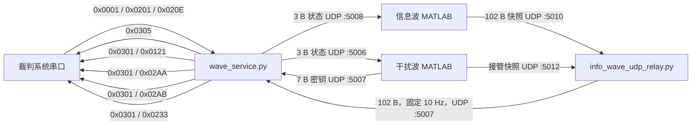

# 解析结果利用与通信说明

本文说明电磁波解析结果如何在 MATLAB、Python 和 RoboMaster 裁判系统之间传递，以及各类结果最终如何转换为比赛业务消息。字段、端口、发送条件和频率均对应当前代码。

## 1. 通信链路总览



默认通信全部使用回环地址 `127.0.0.1`，只有 Pluto 设备通过 `192.168.2.1` 和 `192.168.3.1` 访问。UDP 只负责本机进程间传输，不应暴露到外部网络。

| 端口 | 发送方 | 接收方 | 数据 | 默认频率 |
|---:|---|---|---|---:|
| `5006` | Python | 干扰波 MATLAB | 3 字节比赛状态 | 10 Hz |
| `5007` | 干扰波 MATLAB、快照 relay | Python | 7 字节密钥或 102 字节信息快照 | 事件触发 / 10 Hz |
| `5008` | Python | 信息波 MATLAB | 3 字节比赛状态 | 10 Hz |
| `5010` | 信息波 MATLAB | 快照 relay 主输入 | InfoMsgBag v3 | 默认 10 Hz |
| `5012` | 干扰波 MATLAB | 快照 relay 接管输入 | InfoMsgBag v3 | 接管时默认 10 Hz |

端口可在 `config/wave.env` 中修改，但发送端和接收端必须成对保持一致。

## 2. 裁判状态输入

Python 使用 `wave_runtime.protocol.RefereeStreamDecoder` 从串口字节流中恢复完整裁判帧。解析器支持拆包、粘包、噪声跳过和 CRC 错误后重新同步。当前业务状态只读取三个命令码。

### 2.1 `0x0001` 比赛状态

至少读取 data 区前 3 字节：

| 字段 | 位置 | 用途 |
|---|---|---|
| `game_progress` | `data[0]` bit4～7 | 等于 `4` 时进入比赛业务阶段 |
| `stage_remain_time` | `data[1:3]`，小端 | 状态监视和日志 |

当状态从非 `4` 进入 `4` 时，程序认为新小局开始，并清空上一局的信息缓存、坐标时效、最大血量统计和密钥状态。

### 2.2 `0x0201` 机器人状态

读取 `data[0]` 的 `robot_id`：

- `9`：红方雷达站；
- `109`：蓝方雷达站；
- 小于 `100`：选择红方信息源与红方接收者 ID；
- 大于等于 `100`：选择蓝方信息源与蓝方接收者 ID。

比赛业务串口发送只接受雷达 ID `9` 或 `109`。运行过程中机器人 ID 改变时也会重置本局缓存，防止两方数据混用。

### 2.3 `0x020E` 雷达信息

读取 `data[0]`：

| 位 | 含义 |
|---|---|
| bit3～4 | 己方当前干扰波加密等级 `own_encrypt_level` |
| bit5 | 密钥是否可修改 `is_key_changeable` |

正式自动流程只在等级 `1` 或 `2` 时选择对应干扰波。等级变为 `3` 或更高时代表本局干扰波阶段结束，停止干扰波解析并回到信息波流程。三级波源只用于手动发射、自制发射源和 Web 物理层测试，不进入自动比赛状态机。

## 3. Python 发给 MATLAB 的状态包

`wave_service.py` 将三个裁判状态压缩为固定 3 字节，并同时发送到 `5006` 和 `5008`。

| 偏移 | 内容 |
|---:|---|
| 0 | bit0～3：`game_progress`；bit4～7 保留为 0 |
| 1 | `robot_id` |
| 2 | bit0～1：`own_encrypt_level`；bit2：`is_key_changeable`；bit3～7 保留为 0 |

例如，比赛阶段为 `4`、红方雷达 ID 为 `9`、加密等级为 `2` 且允许修改时，状态包为：

```text
04 09 06
```

MATLAB 只有在 `game_progress == 4` 时才输出比赛业务结果。信息波进程依据 `robot_id` 选择本方广播源；干扰波进程依据阵营和等级选择本方一级或二级干扰源。

## 4. 干扰波密钥回传

干扰波成功解析 `0x0A06` 后，MATLAB 向 `127.0.0.1:5007` 发送固定 7 字节：

| 偏移 | 长度 | 内容 |
|---:|---:|---|
| 0 | 1 | 密钥指令，固定为 `2`，表示验证密钥 |
| 1 | 6 | 6 字节可打印 ASCII 密钥 |

密钥 `abcdef` 的 UDP 数据为：

```text
02 61 62 63 64 65 66
```

Python 接收密钥时会执行以下检查：

1. 当前比赛阶段必须为 `4`；
2. 当前加密等级必须为 `1` 或 `2`；
3. 首字节必须为 `2`；
4. 后 6 字节必须全部是可打印 ASCII；
5. 等级变化后，不接受被标记为上一等级旧密钥的重复包。

通过检查后，密钥进入“等待裁判验证”状态，并持续通过 `0x0301/0x0121` 发送。等级从 `1` 变为 `2`、从 `2` 变为 `3`，或直接变为 `3` 以上时，当前验证状态终止，密钥指令恢复为 `0`。新小局也会清空密钥。

MATLAB 在等待裁判等级变化期间仍继续解析当前等级。如果再次解析出不同密钥，会立即用新密钥更新 7 字节回传包。

## 5. InfoMsgBag v3 信息快照

五类信息命令不是要求在同一个采样窗口内同时出现。MATLAB 分别校验并缓存每个命令，随后用固定 102 字节快照传递当前完整状态。

`InfoMsgBag v3` 是当前唯一信息快照协议。发送端只生成 v3，relay 只接受 v3，Python 也只接受魔数、版本和长度全部正确的 v3 数据报。

### 5.1 包布局

| 偏移 | 长度 | 内容 |
|---:|---:|---|
| 0 | 2 | ASCII 魔数 `IF`，即 `49 46` |
| 2 | 1 | 版本，固定 `03` |
| 3 | 1 | bit0～4：`valid_mask`；bit5～7：`update_index` |
| 4 | 1 | bit0～4：`fresh_mask` |
| 5 | 2 | 快照 `seq`，`uint16` 小端 |
| 7 | 24 | `0x0A01` 原始 dataBytes |
| 31 | 12 | `0x0A02` 原始 dataBytes |
| 43 | 10 | `0x0A03` 原始 dataBytes |
| 53 | 8 | `0x0A04` 原始 dataBytes |
| 61 | 41 | `0x0A05` 原始 dataBytes |

总长度为 `7 + 24 + 12 + 10 + 8 + 41 = 102` 字节。所有多字节业务数值保持裁判协议中的小端顺序。

### 5.2 掩码含义

`valid_mask` 和 `fresh_mask` 的 bit0～4 依次对应：

| bit | 命令 | 数据 |
|---:|---|---|
| 0 | `0x0A01` | 对方六类机器人坐标 |
| 1 | `0x0A02` | 对方机器人血量 |
| 2 | `0x0A03` | 对方机器人允许发弹量 |
| 3 | `0x0A04` | 经济与增益点信息 |
| 4 | `0x0A05` | 防御、负防御、状态和姿态 |

- `valid=1`：本小局至少成功解析过一次该命令，对应缓存可以使用；
- `fresh=1`：该命令最近 3 秒内成功更新；
- `valid` 不会因短时断波自动清零；
- `fresh` 会随时间自动清零；
- 新小局开始时两者与全部缓存一起清零。

因此，持续业务字段通常使用 `valid` 门控并保留最后一次有效值；对时效敏感的坐标和可瞄准状态同时使用更新事件或 `fresh` 门控。

### 5.3 `update_index` 和 `seq`

`update_index` 表示本快照自上次发送以来由哪个命令触发更新：

| 值 | 含义 |
|---:|---|
| 0 | 心跳或没有新的命令更新 |
| 1～5 | 分别对应 `0x0A01`～`0x0A05` |

`seq` 只在至少一个命令缓存更新时递增，范围为 `0～65535` 并自然回绕。心跳快照重复相同的 `seq`，接收端不会将心跳误认为新的坐标帧。

如果一个解码窗口中有多个命令更新，`0x0A01` 的更新标记优先保留，因为坐标转发要求精确续期 250 ms 时效；其他字段的值仍会正常写入快照。

## 6. 快照主备 relay

`info_wave_udp_relay.py` 将两个 MATLAB 来源仲裁后，以固定 10 Hz 输出到 Python：

- `5010` 是信息波接收板的主输入；
- `5012` 是干扰波接收板的接管输入；
- 主输入持续正常时始终优先；
- 主输入连续 `0.5 s` 未到达且接管输入仍活跃时，切换到接管输入；
- 主输入恢复后立即切回主输入；
- 当前来源超过 `3 s` 没有新快照时，relay 输出中的 `fresh_mask` 清零；
- `valid_mask` 和已缓存 payload 保留，供非时效业务继续使用。

为避免一次命令更新刚好落在 relay 输出相位之间，relay 会将 `update_index` 和对应 `seq` 锁存 3 个输出周期。坐标更新事件因此有约 300 ms 的可见窗口。

双板职责由 `FSK_RRC_AutoMatchUdp.m` 的状态机决定：

| 设备状态与裁判等级 | 信息波板 | 干扰波板 |
|---|---|---|
| 两板在线，等级 `<3` | 解析信息波 | 按等级解析一级/二级干扰波 |
| 干扰波板掉线，等级 `<3` | 临时解析当前一级/二级干扰波 | 不可用 |
| 信息波板掉线，等级 `<3` | 不可用 | 继续解析当前一级/二级干扰波 |
| 信息波板掉线，等级 `>=3` | 不可用 | 接管信息波并向 `5012` 输出快照 |
| 干扰波板恢复或等级 `>=3` | 按规则恢复信息波 | 停止干扰波或结束接管 |

任何状态下，等级 `>=3` 都不会触发三级干扰波自动解析。

## 7. Python 对 UDP 的处理

`5007` 同时承载不同长度的数据报。`WaveRuntimeService._drain_wave_udp()` 会循环调用 `recvfrom()`，直至套接字暂时为空，并严格按到达顺序逐包处理：

| 长度 | 类型 | 行为 |
|---:|---|---|
| 7 | 密钥包 | 校验并更新密钥验证状态 |
| 102 | InfoMsgBag v3 | 更新五命令缓存和时效 |
| 其他 | 非法包 | 计入 `ignored_datagrams` |

不能采用“只保留 socket 中最后一包”的实现。密钥包和快照包可能在同一个事件循环周期内连续到达，只处理最后一包会随机丢失其中一种业务。

Python 对快照的缓存规则为：

1. 仅在比赛阶段 `4` 接受信息快照；
2. 只用 `valid_mask=1` 的片段覆盖对应本地缓存；
3. `0x0A01` 有明确 `update_index=1` 时，使用 16 位 `seq` 判断是否为新事件；
4. `update_index` 不是 `1` 时不会续期坐标，心跳快照不能冒充坐标更新；
5. 坐标转发有效期为收到新坐标后的 `0.25 s`；
6. 整个快照超过 `3 s` 未收到时，对外报告的 `fresh_mask` 清零。

## 8. 裁判串口帧封装

所有发往裁判系统的消息统一使用以下外层格式：

```text
frame_header  5 B  A5 + data_length(u16 LE) + seq(u8) + CRC8
cmd_id        2 B  uint16 little-endian
data          n B
CRC16         2 B  覆盖 header、cmd_id 和 data，little-endian
```

关键约束：

- `data_length` 只等于 data 区长度，不包含 2 字节 `cmd_id`；
- CRC8 覆盖帧头前 4 字节，初值为 `0xFF`；
- CRC16 覆盖尾 CRC 之前的整帧，初值为 `0xFFFF`；
- 外层 `seq` 每实际构造一个待发送帧递增并按 8 位回绕；
- 串口断线后每秒尝试重连，自动探测会跳过 Pluto 虚拟串口。

`0x0301` 交互消息的 data 区统一为：

```text
data_cmd_id  uint16 LE
sender_id    uint16 LE
receiver_id  uint16 LE
user_data    0～112 B
```

红方发送者为 `9`，蓝方发送者为 `109`。

## 9. 解析信息的比赛利用

### 9.1 `0x0305` 雷达地图坐标

`0x0A01` 的 24 字节 data 包含对方六类机器人的 12 个 `uint16` 坐标，单位为 cm。程序将其放入 `0x0305 map_robot_data_t` 的前半部分，己方六类坐标来源于哨兵。

顺序为：

```text
对方英雄 x/y、工程 x/y、3号 x/y、4号 x/y、空中 x/y、哨兵 x/y，
己方英雄 x/y、工程 x/y、3号 x/y、4号 x/y、空中 x/y、哨兵 x/y
```

共 24 个 `uint16`、48 字节。仅在比赛阶段 `4`、雷达 ID 有效且最近 `0.25 s` 出现新的 `0x0A01` 更新时，以 5 Hz 发送；过期后停止发送旧坐标。

### 9.2 `0x0301/0x0121` 密钥验证

接收者固定为服务器 `0x8080`。user_data 为 8 字节：

| 偏移 | 长度 | 内容 |
|---:|---:|---|
| 0 | 1 | `radar_cmd`，当前固定为 `0` |
| 1 | 1 | 密钥指令：未获得有效密钥为 `0`，验证密钥为 `2` |
| 2 | 6 | 6 字节 ASCII 密钥 |

只有收到当前等级的合法 MATLAB 密钥后才发送验证消息。启动、新小局和等级变化后不会用无效密钥浪费验证机会。当前实现不会发送密钥修改指令 `1`。

### 9.3 `0x0301/0x02AA` 工程信息

接收者为己方工程：红方 `2`，蓝方 `102`。user_data 固定 4 字节：

| 偏移 | 长度 | 来源 |
|---:|---:|---|
| 0 | 2 | `0x0A03` 偏移 6：空中机器人允许发弹量，`uint16 LE` |
| 2 | 2 | `0x0A04` 偏移 0：对方剩余金币，`uint16 LE` |

当 `0x0A03` 或 `0x0A04` 任一 valid 后开始发送。尚未 valid 的字段保持 `0`；已 valid 的字段即使暂时不 fresh，也继续发送最后一次有效缓存。

### 9.4 `0x0301/0x02AB` 机器人摘要组播

仅当 `0x0A02`、`0x0A03`、`0x0A05` 全部 valid 时发送。接收者为己方英雄、3 号和 4 号：

| 阵营 | 接收者 ID |
|---|---|
| 红方 | `1`、`3`、`4` |
| 蓝方 | `101`、`103`、`104` |

三个接收者的份额按 `1:2:2` 分配。user_data 为五条连续的 6 字节记录，总计 30 字节，顺序为对方英雄、工程、3 号、4 号、哨兵：

| 记录偏移 | 长度 | 含义 |
|---:|---:|---|
| 0 | 1 | 血量百分比 `0～100` |
| 1 | 2 | 允许发弹量，工程固定为 `0` |
| 3 | 1 | 防御值 |
| 4 | 1 | 负防御值 |
| 5 | 1 | 是否可瞄准 |

血量百分比使用“当前血量 / 本小局已观测最大血量”计算，五类机器人分别维护最大值，并在新小局清零。哨兵处于特殊姿态 `5` 时按不可瞄准处理。

### 9.5 `0x0301/0x0233` 哨兵可瞄准位

接收者为己方哨兵：红方 `7`，蓝方 `107`。user_data 固定 1 字节：

| 位 | 含义 |
|---:|---|
| bit0 | 英雄可瞄准 |
| bit1 | 工程可瞄准 |
| bit2 | 3 号可瞄准 |
| bit3 | 4 号可瞄准 |
| bit4 | 哨兵可瞄准 |
| bit5～7 | 固定为 `1` |

当 `0x0A05` 不 valid 或不 fresh 时发送默认值 `0xFD`：工程不可瞄准，其余四类可瞄准。数据 fresh 时，英雄、3 号、4 号的主状态非 0 则不可瞄准；工程只有主状态为 0 时可瞄准；哨兵主状态非 0 或姿态为 5 时不可瞄准。

该消息在比赛阶段 `4` 持续发送，不因 `0x0A05` 缺失而停发。

## 10. 发送调度与频率

`0x0305` 使用单独的 5 Hz 定时器。四类 `0x0301` 业务共用 28 Hz 槽位时钟，权重为：

| 槽位 | 权重 | 正常用途 |
|---|---:|---|
| 密钥决策槽 | 5 | 有待验证密钥时发送 `0x0121`；否则借给 `0x02AB` |
| 工程信息槽 | 5 | 数据 ready 时发送 `0x02AA` |
| 哨兵槽 | 5 | 发送 `0x0233` |
| 摘要槽 | 8 | 数据 ready 时发送 `0x02AB` |
| 保留槽 | 5 | 当前不发送与电磁波无关的消息 |

因此：

- `0x0121` 有待验证密钥时最高约 5 Hz；
- `0x02AA` ready 时最高约 5 Hz；
- `0x0233` 约 5 Hz；
- `0x02AB` 正常约 8 Hz，没有待验证密钥时可使用决策空槽，合计约 13 Hz；
- 未满足发送门控的槽位直接跳过，不会用空包占用串口；
- 28 Hz 是调度槽频率，不代表每秒固定发送 28 个交互包。

所有比赛业务消息都要求 `game_progress == 4` 且机器人 ID 为 `9` 或 `109`。

## 11. 状态、日志与故障定位

`wave_service.py` 每秒更新 `.runtime/status.json`，主要字段包括：

| 字段 | 含义 |
|---|---|
| `game_progress`、`game_remaining_time` | 当前比赛状态 |
| `robot_id`、`faction` | 雷达 ID 与阵营 |
| `own_encrypt_level` | 裁判反馈的干扰等级 |
| `key_verify_pending`、`key_text` | 是否正在验证密钥及其文本 |
| `info_valid_mask`、`info_fresh_mask`、`info_seq` | 信息快照状态 |
| `position_fresh` | 坐标是否仍在 250 ms 转发窗口内 |
| `serial_connected`、`serial_port` | 裁判串口连接状态 |
| `serial_crc_errors` | 串口接收 CRC 错误计数 |
| `info_datagrams`、`key_datagrams`、`ignored_datagrams` | UDP 分类计数 |
| `tx_counts` | 各类裁判消息成功发送计数 |

可执行：

```bash
python3 monitor_status.py
```

常见故障判断顺序：

1. `game_progress` 是否为 `4`，`robot_id` 是否为 `9` 或 `109`；
2. `serial_connected` 是否为 `true`；
3. 干扰等级是否确实为 `1` 或 `2`；
4. MATLAB 日志中是否出现有效协议帧和快照发送；
5. relay 日志中的 active source、`valid`、`fresh` 是否正确；
6. `info_datagrams` 或 `key_datagrams` 是否持续增加；
7. 对应业务的 valid/fresh 门控是否满足；
8. `tx_counts` 是否增长。

## 12. 代码入口索引

| 功能 | 文件 |
|---|---|
| 正式进程编排 | `start.sh` |
| MATLAB 状态机、双板接管、快照构造 | `FSK_RRC_AutoMatchUdp.m` |
| 快照主备仲裁 | `info_wave_udp_relay.py` |
| Python 运行服务与发送调度 | `wave_runtime/service.py` |
| UDP、InfoMsgBag、裁判帧封装 | `wave_runtime/protocol.py` |
| 比赛状态、密钥生命周期、业务数据构造 | `wave_runtime/state.py` |
| 串口探测、重连和非阻塞收发 | `wave_runtime/serial_io.py` |
| CRC8/CRC16 | `wave_runtime/crc.py` |
| 协议与状态回归测试 | `tests/test_protocol.py`、`tests/test_state.py`、`tests/test_service.py`、`tests/test_relay.py` |

解析物理层与空口协议的细节见 [解析算法说明](decoding_algorithm.md)，环境安装和设备配置见 [Linux 部署说明](linux_deployment.md)。
