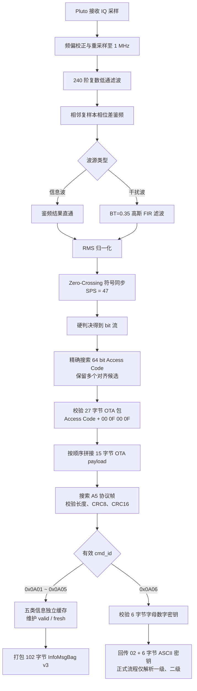

# 解析算法说明

本文说明从 Pluto IQ 采样到 `0x0A01`～`0x0A06` 业务数据的完整解析过程。所有参数和行为均对应当前代码。

## 算法总览



信息波与干扰波共用 IQ 预处理、鉴频、符号同步、OTA 提取和协议 CRC 校验链路；区别在于鉴频后的滤波方式，以及有效业务帧进入缓存快照或密钥回传两个出口。

## 1. 波源模型

公共调制参数：

| 参数 | 数值 |
|---|---:|
| 解码采样率 `Fs` | `1 MHz` |
| 每符号采样点 `SPS` | `47` |
| 符号率/比特率 | `1e6 / 47 ≈ 21.2766 kbit/s` |
| GFSK `BT` | `0.35` |
| 高斯滤波跨度 | `4 symbols` |
| 周期频率 | `10 Hz` |
| 信息波数据推送速率 | `1400 byte/s` |
| 干扰波数据推送速率 | `1350 byte/s` |

波源配置由 `core/get_gfsk_source_config.m` 统一定义：

| 波源 | 中心频率 | 标称占用带宽 | Pluto RX 带宽 | 类型 |
|---|---:|---:|---:|---|
| `red_broadcast` | 433.20 MHz | 0.54 MHz | 0.6875 MHz | 信息波 |
| `red_l1_jammer` | 432.20 MHz | 0.94 MHz | 1.1750 MHz | 一级干扰波 |
| `red_l2_jammer` | 432.50 MHz | 0.86 MHz | 1.0750 MHz | 二级干扰波 |
| `red_l3_jammer` | 432.80 MHz | 0.25 MHz | 0.3125 MHz | 三级测试波源 |
| `blue_broadcast` | 433.92 MHz | 0.54 MHz | 0.6875 MHz | 信息波 |
| `blue_l1_jammer` | 434.92 MHz | 0.94 MHz | 1.1750 MHz | 一级干扰波 |
| `blue_l2_jammer` | 434.62 MHz | 0.86 MHz | 1.0750 MHz | 二级干扰波 |
| `blue_l3_jammer` | 434.32 MHz | 0.25 MHz | 0.3125 MHz | 三级测试波源 |

Pluto RX 带宽比严格占用带宽大 25%，用于容纳模拟滤波器滚降和现场频偏。`utils/apply_pluto_rx_rf_bandwidth.m` 在设备初始化后写入 IIO 属性，并在 Linux 上读回校验。

正式信息波使用 1 MHz 采集；干扰波使用 2 MHz 采集后重采样到 1 MHz 解码。

## 2. 空口数据层级

解析链路包含三层：

```text
GFSK 符号流
  └── OTA packet
        ├── Access Code       8 bytes
        ├── OTA header        4 bytes
        └── OTA payload      15 bytes
              └── protocol frame stream
                    ├── SOF/header/CRC8
                    ├── cmd_id
                    ├── dataBytes
                    └── CRC16
```

### 2.1 Access Code

| 类型 | Access Code |
|---|---|
| 信息波 | `2F 6F 4C 74 B9 14 49 2E` |
| 干扰波 | `16 E8 D3 77 15 1C 71 2D` |

Access Code 必须逐 bit 完全匹配，不做模糊匹配或纠错。

### 2.2 OTA packet

每个 OTA 包固定 27 字节：

| 偏移 | 长度 | 内容 |
|---:|---:|---|
| 0 | 8 | Access Code |
| 8 | 2 | payload 长度，大端，固定 `0x000F` |
| 10 | 2 | payload 长度副本，大端，固定 `0x000F` |
| 12 | 15 | OTA payload |

因此 OTA 头必须严格为：

```text
00 0F 00 0F
```

`protocol/parse_ota_packet.m` 同时检查 Access Code、两份长度是否一致、长度是否为 15，以及 payload 是否完整。

### 2.3 业务协议帧

OTA payload 按接收顺序拼接为协议字节流。业务帧格式：

```text
SOF             1 byte   固定 A5
data_length     2 bytes  little-endian
seq             1 byte
CRC8            1 byte   覆盖前 4 字节，初值 FF
cmd_id          2 bytes  little-endian
dataBytes       n bytes
CRC16           2 bytes  little-endian，初值 FFFF
```

总长度为 `5 + 2 + data_length + 2`。只有 SOF、CRC8 和 CRC16 全部正确的帧才进入业务解析。

## 3. 信息波和干扰波周期

### 3.1 信息波

信息波每周期 140 字节协议数据，包含五个命令：

| 命令 | data 长度 | 内容 |
|---|---:|---|
| `0x0A01` | 24 | 对方六类机器人 x/y 坐标，共 12 个 `uint16`，单位 cm |
| `0x0A02` | 12 | 英雄、工程、3号、4号、保留、哨兵血量 |
| `0x0A03` | 10 | 英雄、3号、4号、空中、哨兵允许发弹量 |
| `0x0A04` | 8 | 剩余金币、累计金币、增益点状态位 |
| `0x0A05` | 41 | 五类机器人增益、姿态和主状态 |

`0x0A05` 的 41 字节布局：

| 偏移 | 长度 | 内容 |
|---:|---:|---|
| 0 | 7 | 英雄：回复、冷却、防御、负防御、攻击 |
| 7 | 7 | 工程 |
| 14 | 7 | 3号步兵 |
| 21 | 7 | 4号步兵 |
| 28 | 7 | 哨兵 |
| 35 | 1 | 哨兵姿态 |
| 36 | 5 | 英雄、工程、3号、4号、哨兵主状态 |

每个 7 字节增益块为：

```text
regen uint8
cooling uint16
defense uint8
negative_defense uint8
attack uint16
```

### 3.2 干扰波

干扰波每周期 135 字节协议数据。有效业务帧为：

```text
cmd_id = 0x0A06
seq = 7
data_length = 6
dataBytes = 6 字节 ASCII 字母或数字密钥
```

密钥 `abcdef` 的完整协议帧为：

```text
A5 06 00 07 91 06 0A 61 62 63 64 65 66 16 E2
```

干扰波协议流按官方 135 字节周期布局补齐：周期前 10 字节为 `0xCC`，`0x0A06` 帧跨两个 15 字节 OTA payload，尾部使用 `0xDD` 填充。

## 4. Pluto 采样

比赛实测硬件为微相 E310（2T2R），为后续 MIMO 开发预留了双发双收能力。当前解析链路每块板只创建一个 Pluto 接收对象、使用一个接收通道，因此本节算法不依赖 2T2R，也不包含 MIMO 合并。任何能运行 Pluto 兼容固件并被 libiio/MATLAB Pluto 接口识别的 SDR 都可以复用同一采集和解码流程。

接收对象由 `utils/reusable_pluto_rx.m` 创建和复用。关键设置：

- 中心频点：当前波源 `fc` 加可选硬件本振偏移；
- 采样率：信息波 1 MHz，干扰波 2 MHz；
- 帧长：默认 50000 samples；
- 增益：默认 Fast Attack AGC；
- 预热：默认丢弃 4 帧；
- RF 带宽：当前波源的 `rxBandwidth`。

当中心频点、采样率、增益方式或 RF 带宽发生变化时，复用器释放旧对象后重建设备。这样可以避免把上一个波源的硬件配置带入新波源。

可设置 `RxCenterFrequencyOffsetHz` 让硬件本振偏离标称中心；解码前使用复数 NCO：

```text
r[n] = r[n] · exp(j·2π·offset·n/captureFs)
```

将信号数字搬回基带。

## 5. IQ 预处理

入口是 `FSK_RRC_Recv.m` 的 `local_decode_capture`。

### 5.1 重采样

若采样率不等于 1 MHz：

- 普通路径调用 MATLAB `resample`；
- 信息波后台 worker 的整数抽取路径使用 96 阶 Hamming FIR 抗混叠后抽取，避免后台进程调用不安全的 `upfirdnmex`；
- 2 MHz 干扰波按 2:1 降到 1 MHz。

### 5.2 鉴频前复数低通

解码链路固定使用 240 阶 Hamming FIR。截止频率为标称占用带宽的一半：

| 波源 | 截止频率 |
|---|---:|
| 信息波 | 270 kHz |
| 一级干扰波 | 470 kHz |
| 二级干扰波 | 430 kHz |
| 三级测试波源 | 125 kHz |

该滤波器在相位差鉴频前抑制邻道和带外噪声。

## 6. GFSK 鉴频与滤波

`core/fsk_discriminator_hz.m` 使用相邻复样本相位差：

```text
Δφ[n] = angle(r[n] · conj(r[n-1]))
f̂[n] = Δφ[n] · Fs / (2π)
```

当前默认 `QuadratureDemodGain=1.5`，软判决量按 GNU Radio Quadrature Demod 形式计算：

```text
m_raw[n] = Δφ[n] · 1.5
```

不同波源的鉴频后处理：

- 信息波：不再经过高斯 FIR，鉴频输出直接进入符号同步；
- 干扰波：使用 `BT=0.35`、跨度 4 symbols 的高斯 FIR，再进入相同符号同步器。

## 7. 符号同步

鉴频软值先除以 RMS，使同步环输入幅度稳定：

```text
scale = sqrt(mean(abs(metric)^2))
sync_input = real(metric) / scale
```

随后使用 `comm.SymbolSynchronizer`：

| 参数 | 当前值 |
|---|---:|
| Modulation | `PAM/PSK/QAM` |
| TimingErrorDetector | `Zero-Crossing (decision-directed)` |
| SamplesPerSymbol | 47 |
| DampingFactor | 1.0 |
| NormalizedLoopBandwidth | 0.005 |
| DetectorGain | 1.0 |

同步器输出为一符号一点的软判决流。正值判为 1，负值判为 0。

## 8. Access Code 与 bit 对齐

`core/decode_gfsk_symbol_stream.m` 丢弃同步器前 4 个瞬态输出，然后在完整 bit 流中精确搜索 64 bit Access Code。

算法不会假设整个窗口只有一个固定 `bitShift`。长窗口可能因符号同步器偶发插入/删除而出现多个 bit-to-byte 对齐，因此代码执行：

1. 找出每一个精确 Access Code bit 起点；
2. 从每个起点分别截取一个 27 字节 OTA 包；
3. 严格解析 Access Code 和 `00 0F 00 0F` OTA 头；
4. 拒绝重叠、截断或头部错误的候选；
5. 将所有有效 OTA payload 按顺序拼接；
6. 从拼接字节流中提取 CRC 正确的协议帧。

因此同一解码窗口可接受多个不同字节对齐位置上的有效包，但不会放宽任何空口校验条件。

候选评分用于仿真和诊断：

```text
metric = 250 × validProtocolFrames
       + 10 × validOtaPackets
       + 0.001 × mean(abs(symbolMetric))
```

正式接收不使用预期 payload 内容作为通过条件，只依赖 Access Code、OTA 头和协议 CRC。

## 9. 协议帧解析

`protocol/extract_valid_protocol_frames.m` 在 OTA payload 字节流中搜索 `0xA5`，根据 `data_length` 计算完整帧长度，然后调用 `parse_protocol_frame.m`。

帧只有满足以下条件才有效：

1. SOF 为 `0xA5`；
2. 帧长度完整；
3. CRC8 正确；
4. CRC16 正确。

未知命令即使 CRC 正确也不会进入信息缓存。已知命令由 `parse_protocol_frame.m` 解出强类型字段。

## 10. 信息波连续解析

信息波使用连续生产者/消费者结构，入口是 `InfoWaveContinuousReceiver.m`。

### 10.1 采集线程

主 MATLAB 进程唯一持有 Pluto，持续调用 `rx()`：

- 每帧默认 50000 samples；
- 写入 1 秒复数环形缓冲；
- 每 100 ms 形成一个 250 ms 重叠窗口；
- 只在比赛阶段 4 时提交真实解码窗口。

赛前可以初始化 Pluto 和 worker，但不会提交赛前真实 IQ，也不会更新业务缓存。

### 10.2 worker 队列

窗口以 single 复数交错格式写入 `/dev/shm/rm_info_stream_*`。默认启动两个常驻 MATLAB worker：

```text
主进程：Pluto 连续采集、环形缓冲、窗口提交
worker：读取窗口、调用 FSK_RRC_DecodeInfoWindow
本地 UDP：worker 返回小体积解码结果
```

队列有最大 pending 数量，避免解码速度低于采集速度时无限增长。统计项包括：

- `submittedWindowCount`；
- `completedWindowCount`；
- `failedWindowCount`；
- `pendingWindowCount`；
- `overflowCount`；
- `maxSubmitGapSec`。

新小局会清空 pending、环形缓冲和队列文件。已经被 worker 领取的旧窗口即使稍后返回，也会因序号不再存在而丢弃。

### 10.3 命令更新

一个窗口可能解出同一命令的多个帧。`core/filter_info_wave_updates.m` 负责按协议序号和窗口位置过滤重复更新。

五个命令各自维护：

- 最新原始 `dataBytes`；
- 是否至少成功解析过一次；
- 最近更新时间；
- 接受次数。

只有某个命令自身 CRC 完整时才更新该命令；其他命令解析失败不会清除已有缓存。

## 11. 信息快照

MATLAB 将五个缓存打包为 102 字节 InfoMsgBag v3。解析算法侧维护两类掩码：

- `valid_mask`：本小局内该命令是否至少成功解析过一次；
- `fresh_mask`：该命令是否在最近 3 秒内更新。

每次成功更新命令时 `seq` 自增。byte3 高 3 bit 记录本次更新的命令索引。若同一批结果同时包含多个命令，`0x0A01` 更新标记具有最高优先级，确保坐标内容即使没有变化也能刷新 250 ms 坐标看门狗。

快照以 10 Hz 周期发送。周期重发保持相同 `seq`，不会被接收端误判为新命令。

## 12. 干扰波解析

干扰波不使用连续多 worker 窗口，而是根据裁判反馈等级周期采集并调用 `FSK_RRC_Recv`：

1. 根据机器人 ID 判断己方颜色；
2. 等级 1 选择 `red_l1_jammer` 或 `blue_l1_jammer`；
3. 等级 2 选择 `red_l2_jammer` 或 `blue_l2_jammer`；
4. 只接受 CRC 正确的 `0x0A06`；
5. 只接受长度为 6 且全部为字母/数字的密钥；
6. 将密钥封装为 `02 + 6 字节 ASCII` 回传。

等待裁判反馈升级期间仍继续解析当前等级。若同一等级中解析出不同新密钥，会立即替换并发送。

等级 `>=3` 表示本局干扰波阶段结束，正式自动流程停止干扰波解析并按设备在线状态继续或接管信息波。三级波源配置只供 `FSK_RRC_Recv`、`FSK_RRC_Trans`、`trans.m` 和 Web 页面进行自制发射源或物理层测试。

## 13. 双板接管

`FSK_RRC_AutoMatchUdp.m` 中两个进程分别使用 `info_primary` 和 `jammer_primary` 角色。每个进程通过后台 IIO/ping 探测维护两块板的在线状态。

| 状态 | 行为 |
|---|---|
| 两板在线 | 信息板解析信息波，干扰板解析当前一级/二级干扰波 |
| 干扰板离线、信息板在线、等级 1/2 | 信息板临时解析当前干扰波 |
| 干扰板离线、信息板在线、等级 `>=3` | 信息板继续解析信息波 |
| 信息板离线、干扰板在线、等级 1/2 | 干扰板优先解析当前干扰波 |
| 信息板离线、干扰板在线、等级 `>=3` | 干扰板接管信息波 |

连续失败达到阈值后，设备探测进入低频退避，避免掉线板反复阻塞在线板采集。

## 14. 参数调整建议

优先使用 Web 实时诊断观察：

- ADC 削顶比例；
- 实际 RX 增益；
- RMS dBFS；
- SNR 估计；
- 频偏；
- 占用带宽；
- Access Code 候选数；
- 有效 OTA 包数；
- CRC 正确协议帧数。

调参顺序建议：

1. 确认中心频点和网络设备正确；
2. 确认 RF 带宽覆盖信号且不过宽；
3. 排除削顶和严重邻道干扰；
4. 检查鉴频前通道滤波；
5. 检查符号同步输出数量和 Access Code 候选；
6. 最后再调整同步环带宽、阻尼和 detector gain。

不要通过降低 CRC、Access Code 或 OTA 头校验强度来提高“成功率”。这些条件是区分真实帧与噪声候选的最终边界。

## 15. 代码入口索引

| 任务 | 入口 |
|---|---|
| 波源参数 | `core/get_gfsk_source_config.m` |
| Pluto 单窗口接收 | `FSK_RRC_Recv.m` |
| 信息波持续接收 | `InfoWaveContinuousReceiver.m` |
| 符号流解码 | `core/decode_gfsk_symbol_stream.m` |
| OTA 解析 | `protocol/parse_ota_packet.m` |
| 协议帧解析 | `protocol/parse_protocol_frame.m` |
| 比赛状态机与接管 | `FSK_RRC_AutoMatchUdp.m` |
| 波形生成 | `core/build_gfsk_tx_waveform.m` |
| 仿真 | `FSK_RRC_Sim.m` |
| 实时诊断 | `FSK_RRC_WebDiagnosticWorker.m` |
