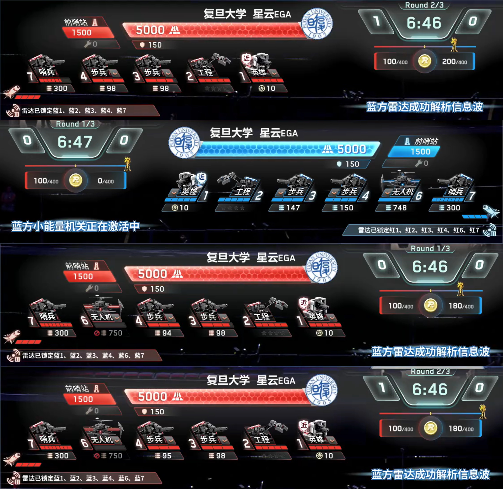

# 比赛实绩与应用案例

本页汇总电磁波解析项目在 RoboMaster 比赛中的实际效果。`display/` 中的图片和视频仅用于展示实绩与下游应用，不是程序运行依赖。

## 1. 赛事统计结果

### 1.1 雷达局均易伤全国第一

全国总决赛官方展示中，复旦大学星云 EGA 的雷达局均易伤时间为 `2303.7 秒/局`，全国第一。信息波持续解析敌方机器人位置，并通过 `0x0305` 等数据链路提供准确坐标，使雷达能够稳定获得和累计易伤收益。

### 1.2 哨兵命中率全国第一

全国总决赛官方展示中，复旦大学星云 EGA 的哨兵总命中率为 `46.13%`，全国第一。项目根据 `0x0A05` 生成 `0x0233` 可瞄准位，哨兵据此过滤无敌和当前不可攻击目标，减少无效射击，提高有效目标上的命中率。

### 1.3 易伤时间与解析成功次数统计

赛事统计页面同时显示，复旦大学星云 EGA 的局均易伤时间和解析成功次数达到全国第一。该结果反映了解析链路在真实赛场射频环境下的稳定性，以及解析结果进入比赛决策链路后的实际收益。

## 2. 三级干扰波解析能力

下图记录了比赛中解析三级干扰波的实际画面，场均约 14 秒完成解析。该结果用于佐证 GFSK、Access Code、OTA 和 `0x0A06` 密钥解析链路对三级自制发射源的物理层能力。

当前正式自动比赛状态机仍严格按裁判反馈执行：只自动解析一级和二级，反馈等级 `>=3` 时回到信息波流程。三级波源配置、手动发射和 Web 收发入口保留，用于自制发射源、接收链路与协议能力测试。

## 3. 工程操作手 UI：无人机发弹量与剩余经济

[点击查看“敌方无人机发弹量、剩余经济实时显示”视频](../display/敌方无人机发弹量、剩余经济实时显示.mp4)

信息波解析得到：

- `0x0A03` 中敌方空中机器人允许发弹量；
- `0x0A04` 中敌方剩余金币。

项目通过 `0x0301/0x02AA` 将两个 `uint16` 字段发送给己方工程机器人。工程端将数据绘制到操作手 UI，使操作手能够实时掌握敌方无人机火力和经济状态。

## 4. 动态目标 UI：血量、增益与发弹量

[点击查看“敌方血量、增益、发弹量实时显示”视频](../display/敌方血量、增益、发弹量实时显示.mp4)

项目综合使用：

- `0x0A02`：敌方英雄、工程、3 号、4 号和哨兵血量；
- `0x0A03`：对应机器人的允许发弹量；
- `0x0A05`：防御、负防御、状态和姿态。

上述信息被整理为 `0x0301/0x02AB` 五条机器人摘要记录。下游 UI 结合自瞄模块当前识别或瞄准的敌方机器人 ID，匹配对应记录并动态显示该目标的血量百分比、增益、负增益和剩余发弹量。

## 5. 哨兵目标筛选：不攻击无敌目标

[点击查看“哨兵不打无敌目标”视频](../display/哨兵不打无敌目标.mp4)

项目根据 `0x0A05` 的五类机器人状态和哨兵姿态生成 `0x0301/0x0233` 可瞄准位。哨兵端使用这些标志过滤无敌或当前不可攻击目标，避免浪费跟踪和射击时间。

当信息尚未新鲜时，项目发送文档中定义的安全默认值；获得新鲜状态后，再实时更新英雄、工程、3 号、4 号和哨兵的可瞄准性。

## 6. 敌方位置再利用：哨兵过洞路径判断

[点击查看“哨兵过洞路径判断”视频](../display/哨兵过洞路径判断.mp4)

`0x0A01` 提供敌方六类机器人坐标。项目首先通过 `0x0305` 转发地图坐标；下游哨兵程序还会统计对方半区两个洞口区域的占用情况，判断哪个洞口更空旷，并据此选择进入对方半区的路径。

该案例说明同一份解析结果除了直接显示，还可以作为路径规划、目标选择和战术状态判断的输入。

## 7. 双 Pluto Web 实时调试

Web 页面同时显示两路 Pluto 的：

- 实时频谱和瀑布图；
- 输入强度、RX 增益、SNR 和频偏；
- 正式带宽、99% 占用带宽和带内功率占比；
- OTA 包、协议帧成功率与累计成功率；
- `0x0A01`～`0x0A05` 各命令实时解析帧率；
- ADC 削顶、采集溢出和解析趋势。

页面入口和使用方法见项目 [README](../README.md#web-调试)。

## 8. 数据链路对应关系

| 展示效果 | 解析来源 | 项目输出 | 下游用途 |
|---|---|---|---|
| 三级干扰波解析 | `0x0A06` | 7 字节密钥包 | 自制发射源与物理层能力验证 |
| 无人机发弹量、剩余经济 | `0x0A03`、`0x0A04` | `0x0301/0x02AA` | 工程操作手 UI |
| 血量、增益、发弹量 | `0x0A02`、`0x0A03`、`0x0A05` | `0x0301/0x02AB` | 动态目标 UI |
| 无敌目标过滤 | `0x0A05` | `0x0301/0x0233` | 哨兵目标筛选 |
| 过洞路径判断 | `0x0A01` | `0x0305` 与坐标缓存 | 下游哨兵路径规划 |

协议字段、发送条件和频率见[解析结果利用与通信说明](communication_and_usage.md)。
